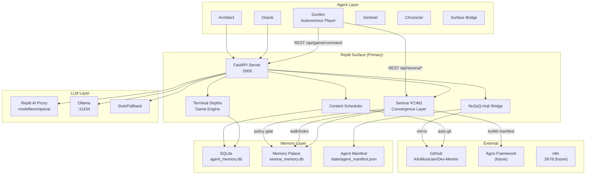
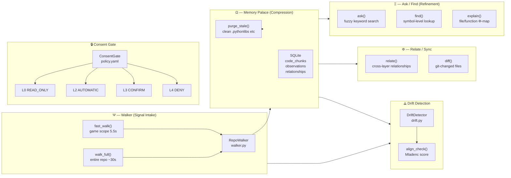
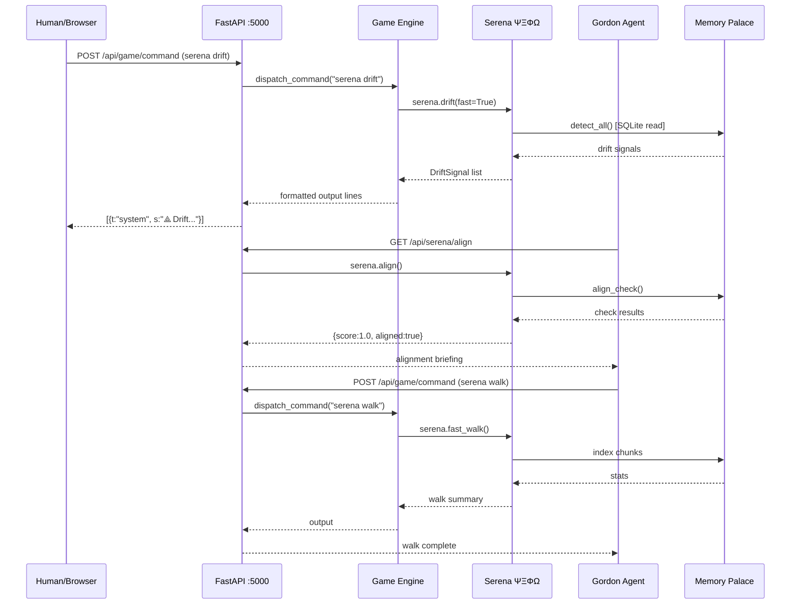
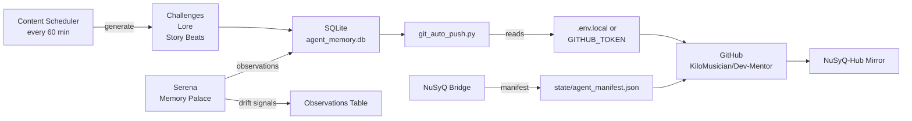
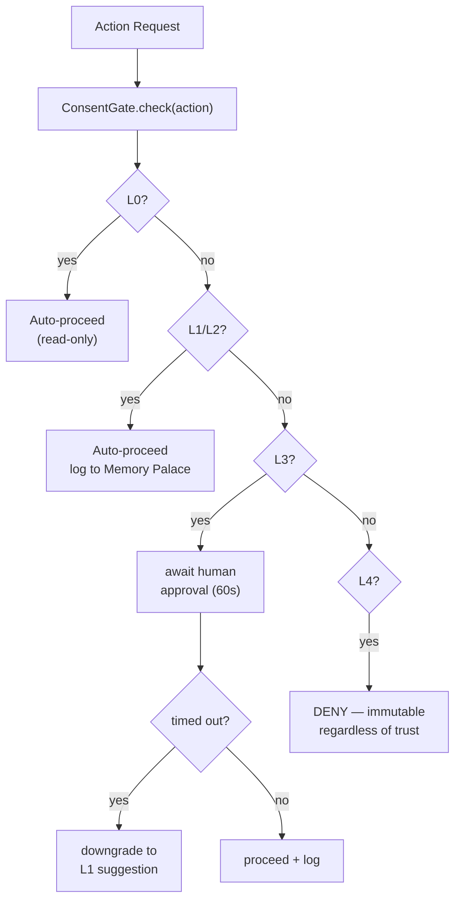

# Dependency Graph — DevMentor Colony

Visual map of service and agent dependencies within the colony.
Generated as part of Phase 0: Inventory & Mapping.

---

## Core Service Dependencies

---

## Serena ΨΞΦΩ Internal Architecture

---

## Agent Communication Flow

---

## Data Flow: Colony → GitHub

---

## Trust Level Flow (L0-L4)

---

*Last updated: auto-generated by diagnostics.py. Run `make diagnose` to refresh.*
