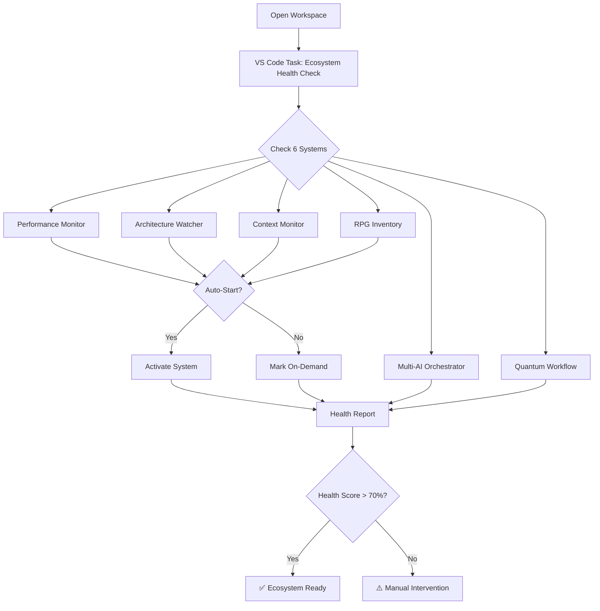
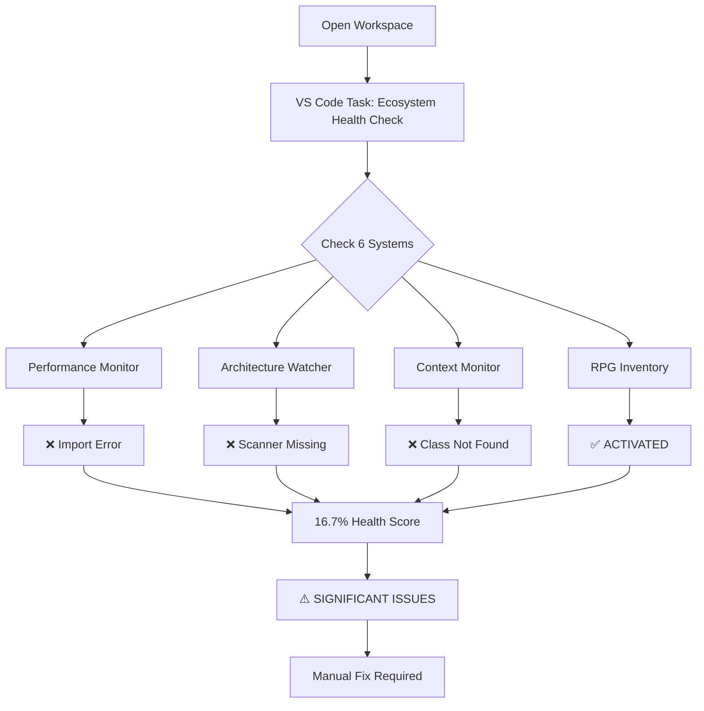

# Ecosystem Startup Automation Guide

## Overview

The NuSyQ-Hub ecosystem includes **6 autonomous systems** designed to activate
automatically and provide continuous health monitoring, error healing, and
capability tracking.

## Autonomous Systems

### 1. 🎯 Performance Monitor (`src/diagnostics/performance_monitor.py`)

- **Purpose**: Real-time performance tracking with graceful shutdown
- **Auto-Start**: Yes (background monitoring)
- **Health Check**: Monitor subprocess, resource usage metrics
- **Status**: ⚠️ DORMANT - Import error (relative import beyond top-level
  package)

### 2. 🏗️ Architecture Watcher (`src/core/ArchitectureWatcher.py`)

- **Purpose**: Real-time repository structure monitoring
- **Auto-Start**: Yes (watches file changes, structural modifications)
- **Health Check**: Scanner process, inotify/FileSystemWatcher active
- **Status**: ⚠️ DORMANT - Activation failed (scanner not found)

### 3. 📡 Real-Time Context Monitor (`src/real_time_context_monitor.py`)

- **Purpose**: Continuous context generation for AI systems
- **Auto-Start**: Yes (monitors file changes for context updates)
- **Health Check**: ContextMonitor instance running
- **Status**: ⚠️ DORMANT - Import error (cannot import ContextMonitor)

### 4. 🤖 Multi-AI Orchestrator (`src/orchestration/multi_ai_orchestrator.py`)

- **Purpose**: Coordinates Copilot, Ollama, ChatDev, consciousness systems
- **Auto-Start**: No (on-demand for heavy workflows)
- **Health Check**: Orchestrator instance initialized
- **Status**: ✅ AVAILABLE (on-demand activation only)

### 5. ⚛️ Quantum Workflow Automator (`src/workflows/quantum_workflow_automation.py`)

- **Purpose**: Automated task orchestration with self-healing
- **Auto-Start**: No (triggered by quest system or manual invocation)
- **Health Check**: Workflow engine running
- **Status**: ✅ AVAILABLE (on-demand activation only)

### 6. 🎮 RPG Inventory System (`src/Rosetta_Quest_System/rpg_inventory.py`)

- **Purpose**: Capability tracking, auto-healing, semantic quest management
- **Auto-Start**: Yes (maintains capability catalog)
- **Health Check**: Inventory database accessible, heal() method functional
- **Status**: ✅ ACTIVATED successfully

## VS Code Integration

### Automatic Startup Task

Location: `.vscode/tasks.json`

```json
{
  "label": "🏥 Ecosystem Startup Health Check",
  "type": "shell",
  "command": "python",
  "args": ["-m", "src.diagnostics.ecosystem_startup_sentinel"],
  "group": "build",
  "presentation": {
    "echo": true,
    "reveal": "always",
    "focus": false,
    "panel": "shared",
    "showReuseMessage": false,
    "clear": false
  },
  "runOptions": {
    "runOn": "folderOpen"
  }
}
```

**This task runs automatically when you open the workspace!**

### Manual Execution

```powershell
# Run the startup sentinel manually
python -m src.diagnostics.ecosystem_startup_sentinel

# Check specific system
python -c "from src.diagnostics.performance_monitor import PerformanceMonitor; PerformanceMonitor().start()"
```

## Health Check Report

Current ecosystem health score: **16.7%** (1/6 systems active)

### Issues Detected

1. **Import Errors**:
   - `performance_monitor.py`: Relative import beyond top-level package
   - `real_time_context_monitor.py`: Cannot import ContextMonitor class
2. **Missing Dependencies**:

   - `ArchitectureWatcher.py`: Scanner component not found

3. **Dormant Systems**:
   - 3 systems failed auto-activation
   - 2 systems on-demand (expected behavior)

### Recommendations

1. **Fix Import Paths**: Convert relative imports to absolute imports from
   `src/`
2. **Restore ArchitectureScanner**: Locate or recreate missing scanner component
3. **Verify Class Names**: Ensure ContextMonitor class exists in
   real_time_context_monitor.py
4. **Re-run Health Check**: After fixes, target >70% health score

## Startup Workflow

### Ideal Startup Sequence



### Current Startup Sequence (Broken)



## Troubleshooting

### Issue: "Relative import beyond top-level package"

**System**: Performance Monitor

**Fix**:

```python
# Before (BROKEN)
from ..utils import logger

# After (FIXED)
from src.utils import logger
```

### Issue: "Cannot import name 'ContextMonitor'"

**System**: Real-Time Context Monitor

**Fix**:

1. Check if class exists: `grep -r "class ContextMonitor" src/`
2. If missing, create class or fix import name
3. Verify module structure matches import statement

### Issue: "Scanner not found"

**System**: Architecture Watcher

**Fix**:

1. Locate `ArchitectureScanner.py`: `find . -name "*Scanner*"`
2. If missing, check git history:
   `git log --all --full-history --source -- "**/ArchitectureScanner.py"`
3. Restore from backup or reimplement

## Activation Commands

### Start All Auto-Start Systems

```powershell
# Windows PowerShell
$systems = @(
    "src.diagnostics.performance_monitor",
    "src.core.ArchitectureWatcher",
    "src.real_time_context_monitor",
    "src.Rosetta_Quest_System.rpg_inventory"
)

foreach ($system in $systems) {
    Start-Process python -ArgumentList "-m", $system -NoNewWindow
}
```

### Start On-Demand Systems

```powershell
# Multi-AI Orchestrator
python -m src.orchestration.multi_ai_orchestrator

# Quantum Workflow Automator
python -m src.workflows.quantum_workflow_automation
```

## Health Monitoring

### Continuous Health Checks

```python
# Add to your development workflow
import schedule
from src.diagnostics.ecosystem_startup_sentinel import EcosystemStartupSentinel

def health_check():
    sentinel = EcosystemStartupSentinel()
    health_score, report = sentinel.run_startup_check()
    if health_score < 70:
        print(f"⚠️ HEALTH WARNING: {health_score}%")
    return report

# Run every 30 minutes
schedule.every(30).minutes.do(health_check)
```

### Health Report Location

- JSON Report: `data/ecosystem_startup_status.json`
- Console Output: Real-time during startup
- VS Code Problems Panel: Import errors surfaced automatically

## Next Steps

### Immediate Actions

1. **Fix Import Errors**: Update relative imports in 3 systems
2. **Restore Missing Components**: Locate ArchitectureScanner.py
3. **Validate Fixes**: Re-run
   `python -m src.diagnostics.ecosystem_startup_sentinel`
4. **Target Health Score**: Achieve >70% (4/6 systems active)

### Long-Term Enhancements

1. **Add System Recovery**: Auto-restart failed systems after timeout
2. **Implement Health Webhooks**: Notify external systems on degradation
3. **Create Dashboard**: Real-time visual health monitoring
4. **Add Predictive Alerts**: ML-based failure prediction

## Related Documentation

- **Module Modernization**: See `docs/MODULE_MODERNIZATION_PLAN.md`
- **Healing Protocols**: See `src/protocols/healing_protocols.py`
- **Import Health**: See `src/diagnostics/ImportHealthCheck.ps1`
- **Quest System**: See `src/Rosetta_Quest_System/quest_log.jsonl`

---

**Last Updated**: 2025-01-15  
**Health Score**: 16.7% → Target: 70%+  
**Status**: 🔴 CRITICAL - Requires immediate attention
