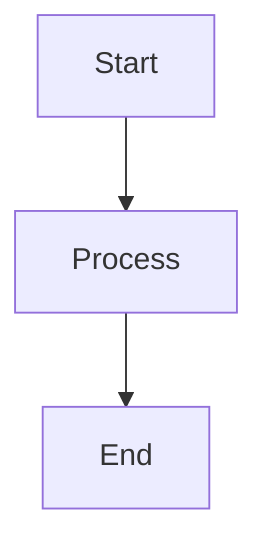

# NuSyQ VS Code Extensions - Complete Guide

## 📦 Installed Extensions Summary

Your VS Code environment now includes **50+ productivity-enhancing extensions** across 10 categories. This guide explains what each does and how to use them effectively.

---

## 🤖 AI Coding Assistants (Multi-Model Orchestration)

### 1. **Claude Code** (`anthropic.claude-code`)
**Purpose:** Primary AI for complex reasoning, architecture, code review

**Features:**
- Advanced code analysis
- Architectural guidance
- Security reviews
- Complex refactoring

**Usage:**
- Click chat icon in sidebar
- Ask architectural questions
- Request code reviews
- Get design recommendations

### 2. **Continue.dev** (`Continue.continue`) ✅
**Purpose:** Local Ollama integration for fast autocomplete and refactoring

**Features:**
- Tab autocomplete with local models
- Inline chat (Ctrl+L)
- Code editing (/edit)
- Test generation (/test)
- Multi-model support

**Usage:**
```
Ctrl+L        - Open chat
Ctrl+I        - Inline edit
Tab           - Accept suggestion
/edit         - Edit selection
/explain      - Explain code
/test         - Generate tests
/comment      - Add documentation
/cmd          - Generate shell command
```

**Configuration:** See [`ollama-copilot-config.md`](ollama-copilot-config.md)

### 3. **Kilo Code** (`kilocode.kilo-code`)
**Purpose:** Additional AI assistance and code suggestions

### 4. **Phind** (`phind.phind`)
**Purpose:** AI-powered search for programming questions

**Usage:**
- Highlight code → Right-click → "Phind Search"
- Get instant explanations and examples

---

## 🐙 Git & Version Control

### 1. **GitLens** (`eamodio.gitlens`) ✅
**Purpose:** Supercharge Git capabilities

**Features:**
- Inline blame annotations
- Commit history
- File history
- Repository insights
- Compare branches

**Usage:**
- Hover over code to see who wrote it
- Click line blame for full commit details
- View file history with `Ctrl+Shift+P` → "GitLens: Show File History"

### 2. **Git Graph** (`mhutchie.git-graph`) ✅ NEW
**Purpose:** Visualize repository history as interactive graph

**Features:**
- Visual commit history
- Branch visualization
- Merge tracking
- Cherry-pick support

**Usage:**
- Click "Git Graph" in status bar
- Or: `Ctrl+Shift+P` → "Git Graph: View Git Graph"

### 3. **Git History** (`donjayamanne.githistory`) ✅
**Purpose:** Explore file and line history

**Usage:**
- Right-click file → "Git: View File History"
- Right-click line → "Git: View Line History"

### 4. **GitHub Pull Requests** (`GitHub.vscode-pull-request-github`)
**Purpose:** Manage PRs without leaving VS Code

**Features:**
- Create/review PRs
- Comment on code
- Merge from editor
- CI status

---

## 📝 Markdown & Documentation

### 1. **Markdown All in One** (`yzhang.markdown-all-in-one`) ✅
**Purpose:** Complete Markdown productivity suite

**Features:**
- Auto-TOC generation
- Keyboard shortcuts
- Math support
- Auto-preview

**Shortcuts:**
```
Ctrl+B        - Bold
Ctrl+I        - Italic
Ctrl+Shift+]  - Heading up
Ctrl+Shift+[  - Heading down
```

### 2. **Markdown Mermaid** (`bierner.markdown-mermaid`) ✅ NEW
**Purpose:** Render Mermaid diagrams in Markdown preview

**Example:**
````markdown

````

### 3. **Markdown Preview Enhanced** (`shd101wyy.markdown-preview-enhanced`)
**Purpose:** Enhanced Markdown preview with advanced features

**Features:**
- PDF export
- Presentation mode
- Math/diagrams
- Custom themes

### 4. **Markdownlint** (`davidanson.vscode-markdownlint`)
**Purpose:** Markdown linting and style checking

---

## 🔍 Code Quality & Analysis

### 1. **SonarLint** (`sonarsource.sonarlint-vscode`) ✅
**Purpose:** Real-time code quality analysis (multi-language)

**Supports:**
- Python, JavaScript, TypeScript
- Java, C/C++, PHP
- Security vulnerabilities
- Code smells
- Best practices

**Usage:** Automatic inline warnings and suggestions

### 2. **Error Lens** (`usernamehw.errorlens`) ✅
**Purpose:** Inline error/warning display

**Features:**
- Errors shown directly in code (no hover needed)
- Customizable error format
- Performance-optimized

### 3. **Code Spell Checker** (`streetsidesoftware.code-spell-checker`) ✅
**Purpose:** Spell checking for code, comments, strings

**Features:**
- Multi-language dictionaries
- Custom word lists
- Camel case support

**Usage:**
- Right-click misspelled word → "Quick Fix"
- Add to dictionary or ignore

### 4. **TODO Tree** (`gruntfuggly.todo-tree`) ✅
**Purpose:** Find and organize TODO/FIXME comments

**Features:**
- Sidebar tree view of all TODOs
- Custom tags (BUG, HACK, NOTE)
- Regex support
- Color coding

**Usage:**
- Click TODO icon in sidebar
- Navigate through all TODOs in workspace

---

## 🚀 Productivity & Navigation

### 1. **Project Manager** (`alefragnani.project-manager`) ✅ NEW
**Purpose:** Manage multiple projects/workspaces

**Features:**
- Save favorite projects
- Quick project switching
- Git repository detection
- Remote project support

**Usage:**
```
Ctrl+Alt+P  - List projects
            - Save/edit project
```

### 2. **Bookmarks** (`alefragnani.bookmarks`) ✅
**Purpose:** Mark important lines and navigate between them

**Features:**
- Toggle bookmarks (Ctrl+Alt+K)
- Navigate next/previous
- List all bookmarks

**Shortcuts:**
```
Ctrl+Alt+K     - Toggle bookmark
Ctrl+Alt+J     - Jump to previous
Ctrl+Alt+L     - Jump to next
```

### 3. **Better Comments** (`aaron-bond.better-comments`) ✅
**Purpose:** Highlight different types of comments

**Color Codes:**
```python
# ! Important warning
# ? Question or query
# TODO: Task to complete
# * Highlighted info
# // Strikethrough comment
```

### 4. **Indent Rainbow** (`oderwat.indent-rainbow`) ✅
**Purpose:** Colorize indentation for better readability

**Features:**
- Different colors per indent level
- Configurable colors
- Error highlighting

### 5. **Path Intellisense** (`christian-kohler.path-intellisense`) ✅
**Purpose:** Autocomplete file paths

**Usage:** Start typing file path in strings → get suggestions

---

## 🎨 Code Visualization

### 1. **Draw.io** (`hediet.vscode-drawio`)
**Purpose:** Create diagrams directly in VS Code

**Features:**
- Flowcharts, UML, ERD
- Network diagrams
- Architecture diagrams
- Export to PNG/SVG

**Usage:** Create `.drawio` file → Edit visually

### 2. **Code Tour** (`vsls-contrib.codetour`)
**Purpose:** Create guided code walkthroughs

**Features:**
- Step-by-step code tours
- Onboarding new developers
- Document complex flows
- Share knowledge

**Usage:**
```
Ctrl+Shift+P → "CodeTour: Start Tour"
```

### 3. **Code Runner** (`formulahendry.code-runner`) ✅
**Purpose:** Run code snippets quickly

**Features:**
- Run file or selection
- Multi-language support
- Custom commands
- Output in terminal

**Usage:**
```
Ctrl+Alt+N   - Run code
Ctrl+Alt+M   - Stop running
```

### 4. **Live Server** (`ritwickdey.liveserver`)
**Purpose:** Launch local development server with live reload

**Features:**
- Auto-refresh on save
- Multi-browser support
- Custom port

**Usage:** Right-click HTML file → "Open with Live Server"

---

## 📋 YAML & Configuration

### 1. **YAML** (`redhat.vscode-yaml`) ✅
**Purpose:** YAML language support with validation

**Features:**
- Schema validation
- Auto-completion
- Kubernetes/Docker compose support
- Syntax highlighting

### 2. **Even Better TOML** (`tamasfe.even-better-toml`)
**Purpose:** TOML file support (Cargo.toml, pyproject.toml)

### 3. **.ENV Support** (`dotenv.dotenv-vscode`)
**Purpose:** Syntax highlighting for .env files

---

## 🗄️ Database & Data

### 1. **SQLTools** (`mtxr.sqltools`)
**Purpose:** Database management and querying

**Supports:**
- PostgreSQL, MySQL, SQLite
- SQL Server, Oracle
- MongoDB, Redis

**Features:**
- Query editor
- Table explorer
- Auto-completion
- Query history

### 2. **Data Preview** (`RandomFractalsInc.vscode-data-preview`)
**Purpose:** Preview CSV, JSON, Excel files

**Features:**
- Tabular data viewer
- Sorting/filtering
- Export functionality

---

## 🧪 Testing & Debugging

### 1. **Test Explorer UI** (`hbenl.vscode-test-explorer`)
**Purpose:** Unified test runner interface

**Features:**
- Run individual tests
- Debug tests
- Test results view
- Multi-framework support

### 2. **Python Test Adapter** (`littlefoxteam.vscode-python-test-adapter`)
**Purpose:** Integrate Python tests (pytest, unittest)

**Usage:**
- Click Test icon in sidebar
- Run/debug tests visually

---

## 🎨 Theme & UI Enhancement

### 1. **Material Icon Theme** (`PKief.material-icon-theme`) ✅
**Purpose:** Beautiful file/folder icons

**Features:**
- 1000+ file type icons
- Customizable colors
- Folder themes

**Activation:** Already active

### 2. **Material Theme** (`zhuangtongfa.material-theme`)
**Purpose:** Popular color themes

**Themes:**
- Material Theme Ocean
- Material Theme Palenight
- Material Theme Darker

**Activation:**
```
Ctrl+K Ctrl+T → Select "Material Theme"
```

### 3. **Peacock** (`johnpapa.vscode-peacock`) ✅ NEW
**Purpose:** Color-code workspaces

**Features:**
- Different colors per project
- Visual workspace identification
- Preset color schemes

**Usage:**
```
Ctrl+Shift+P → "Peacock: Change to a favorite color"
```

---

## 🌐 REST API & HTTP

### 1. **REST Client** (`humao.rest-client`) ✅
**Purpose:** Send HTTP requests directly from VS Code

**Example:**
```http
### Get users
GET https://api.example.com/users
Content-Type: application/json

### Create user
POST https://api.example.com/users
Content-Type: application/json

{
  "name": "John Doe",
  "email": "john@example.com"
}
```

**Usage:**
- Create `.http` or `.rest` file
- Click "Send Request" above request
- View response inline

### 2. **Thunder Client** (`rangav.vscode-thunder-client`)
**Purpose:** Postman alternative in VS Code

**Features:**
- GUI-based API testing
- Collections
- Environment variables
- Import/export

---

## 🔧 Language Support

### 1. **Python** (`ms-python.python`) ✅
Already installed + enhanced with:
- **Black Formatter** (`ms-python.black-formatter`) ✅
- **isort** (`ms-python.isort`)
- **Flake8** (`ms-python.flake8`)

### 2. **C/C++** (`ms-vscode.cpptools`)
**Purpose:** IntelliSense, debugging, code browsing

### 3. **Go** (`golang.go`)
**Purpose:** Go language support

### 4. **Rust** (`rust-lang.rust-analyzer`)
**Purpose:** Rust development with analyzer

### 5. **Java** (`redhat.java`)
**Purpose:** Java language support

---

## 🤝 Collaboration

### **Live Share** (`ms-vsliveshare.vsliveshare`)
**Purpose:** Real-time collaborative coding

**Features:**
- Share VS Code session
- Co-edit files
- Shared debugging
- Voice/chat integration

**Usage:**
```
Ctrl+Shift+P → "Live Share: Start Collaboration Session"
```

---

## ⚙️ Configuration Recommendations

### Auto-Save
```json
{
  "files.autoSave": "afterDelay",
  "files.autoSaveDelay": 1000
}
```

### Format on Save
```json
{
  "editor.formatOnSave": true,
  "editor.formatOnPaste": true,
  "[python]": {
    "editor.defaultFormatter": "ms-python.black-formatter"
  }
}
```

### TODO Tree Custom Tags
```json
{
  "todo-tree.general.tags": [
    "TODO",
    "FIXME",
    "BUG",
    "HACK",
    "NOTE",
    "XXX",
    "[ ]",
    "[x]"
  ]
}
```

### Error Lens Configuration
```json
{
  "errorLens.enabled": true,
  "errorLens.fontSize": "12",
  "errorLens.delay": 500
}
```

---

## 🎯 Productivity Workflows

### Workflow 1: Code Review
```
1. GitLens - View file history
2. Git Graph - See branch structure
3. SonarLint - Check quality
4. Error Lens - View inline issues
5. TODO Tree - Find outstanding tasks
6. Claude Code - Get AI review
```

### Workflow 2: API Development
```
1. Code Runner - Test Python logic
2. REST Client - Test endpoints
3. Thunder Client - Full API testing
4. SQLTools - Query database
5. Error Lens - Catch issues early
```

### Workflow 3: Documentation
```
1. Markdown All in One - Write docs
2. Markdown Mermaid - Add diagrams
3. Draw.io - Create architecture diagrams
4. Code Spell Checker - Fix typos
5. Markdownlint - Ensure quality
```

### Workflow 4: Learning Codebase
```
1. Code Tour - Follow guided tours
2. Bookmarks - Mark important sections
3. Continue.dev /explain - Get AI explanations
4. GitLens - See code history
5. Project Manager - Navigate projects
```

---

## 🚀 Keyboard Shortcuts Master List

### Essential Shortcuts
```
Ctrl+P              - Quick file open
Ctrl+Shift+P        - Command palette
Ctrl+`              - Toggle terminal
Ctrl+B              - Toggle sidebar
Ctrl+J              - Toggle panel

Ctrl+/              - Toggle comment
Ctrl+D              - Select next occurrence
Ctrl+Shift+L        - Select all occurrences

Ctrl+L              - Continue.dev chat (if configured)
Ctrl+K Ctrl+I       - Show hover info
F12                 - Go to definition
Alt+F12             - Peek definition

Ctrl+Alt+K          - Toggle bookmark
Ctrl+Alt+N          - Run code
```

### Git Shortcuts
```
Ctrl+Shift+G        - Source control view
Ctrl+Shift+G G      - Commit
Ctrl+Shift+G P      - Push
```

---

## 📊 Extension Priorities

### Critical (Always Enabled):
- Claude Code, Continue.dev
- GitLens, Error Lens
- Python tools, SonarLint

### High Priority:
- TODO Tree, Bookmarks
- REST Client, Git Graph
- Markdown tools

### Context-Dependent:
- Language-specific (Go, Rust, Java) - Enable per project
- Thunder Client - For API-heavy projects
- Live Share - For collaboration

### Optional (Disable if Slow):
- Draw.io (only when needed)
- Test Explorer (only for test-heavy projects)

---

## 🐛 Performance Tips

**If VS Code feels slow:**

1. **Disable unused language extensions**
```bash
code --disable-extension golang.go  # If not using Go
code --disable-extension rust-lang.rust-analyzer  # If not using Rust
```

2. **Limit file watching**
```json
{
  "files.watcherExclude": {
    "**/.git/objects/**": true,
    "**/node_modules/**": true,
    "**/.venv/**": true
  }
}
```

3. **Disable telemetry**
```json
{
  "telemetry.telemetryLevel": "off"
}
```

---

## ✅ Verification

Check all extensions are working:

```powershell
# List installed extensions
code --list-extensions

# Should include:
# - Continue.continue
# - mhutchie.git-graph
# - usernamehw.errorlens
# - gruntfuggly.todo-tree
# - (50+ total)
```

---

## 🎉 Summary

You now have a **world-class VS Code setup** with:

- ✅ **Multi-model AI** (Claude, Continue, Phind)
- ✅ **Advanced Git** (GitLens, Graph, History)
- ✅ **Code Quality** (SonarLint, Error Lens, Spell Check)
- ✅ **Productivity** (Bookmarks, TODO Tree, Project Manager)
- ✅ **Visualization** (Draw.io, Mermaid, Code Tour)
- ✅ **Testing & API** (REST Client, Thunder Client, Test Explorer)
- ✅ **50+ extensions** optimized for AI development

**🚀 Your development environment is now production-grade!**
