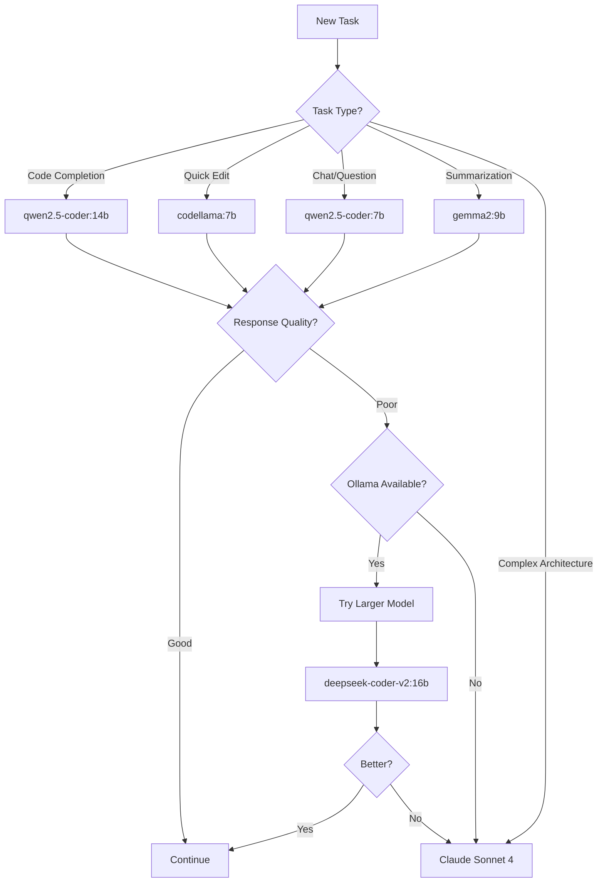
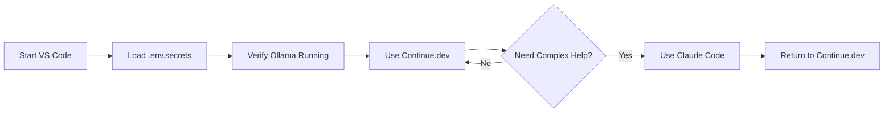

# VS Code Extension Configuration Guide

**NuSyQ AI Ecosystem - Multi-Model Orchestration**

## Table of Contents

- [Overview](#overview)
- [AI Assistant Priority](#ai-assistant-priority)
- [Extension Configuration](#extension-configuration)
- [Environment Setup](#environment-setup)
- [Model Selection](#model-selection)
- [Troubleshooting](#troubleshooting)

---

## Overview

NuSyQ uses a **multi-layered AI approach** prioritizing local Ollama models for cost-efficiency and privacy, with cloud-based APIs as fallbacks.

### Design Philosophy

1. **Ollama First**: All coding tasks use local models (qwen2.5-coder, codellama, deepseek-coder-v2)
2. **Cloud Fallback**: Claude Code and GitHub Copilot only when local models unavailable
3. **Zero Cost Baseline**: Primary workflow incurs no API costs
4. **Flexible Escalation**: Complex tasks can opt into cloud models

---

## AI Assistant Priority

### Priority Order (High to Low)

1. **Continue.dev** (Ollama - LOCAL)
   - Primary coding assistant
   - Code completion, refactoring, chat
   - Uses: qwen2.5-coder:14b, deepseek-coder-v2:16b
   - **Cost: $0.00**

2. **Claude Code** (Anthropic API)
   - Complex reasoning, architecture decisions
   - Code review, documentation
   - Uses: claude-sonnet-4
   - **Cost: ~$3/million tokens (input)**

3. **GitHub Copilot** (OpenAI - DISABLED BY DEFAULT)
   - Traditional code completion
   - Requires subscription
   - **Cost: $10/month or $100/year**

### When to Use Each

| Task | Tool | Model | Why |
|------|------|-------|-----|
| Code completion | Continue.dev | `ollama/qwen2.5-coder:14b` | Fast, local, accurate |
| Refactoring | Continue.dev | `ollama/codellama:7b` | Specialized for code edits |
| Chat/Questions | Continue.dev | `ollama/qwen2.5-coder:7b` | Quick responses |
| Summarization | Continue.dev | `ollama/gemma2:9b` | Reasoning-optimized |
| Complex architecture | Claude Code | `claude-sonnet-4` | Superior reasoning |
| Emergency fallback | GitHub Copilot | OpenAI models | When Ollama down |

---

## Extension Configuration

### 1. Continue.dev (Primary)

**Status**: ✅ **ACTIVE** - Fully configured for Ollama

#### Configuration in `.vscode/settings.json`:

```json
{
  "continue.models": {
    "default": "ollama/qwen2.5-coder:14b",
    "tabAutocomplete": "ollama/deepseek-coder-v2:16b"
  },
  "continue.modelRoles": {
    "default": "ollama/qwen2.5-coder:14b",
    "summarize": "ollama/gemma2:9b",
    "edit": "ollama/codellama:7b",
    "chat": "ollama/qwen2.5-coder:7b"
  },
  "continue.embeddingsProvider": {
    "provider": "ollama",
    "model": "nomic-embed-text"
  },
  "continue.telemetryEnabled": false,
  "continue.enableTabAutocomplete": true
}
```

#### Usage:

- **Ctrl+L**: Open Continue chat
- **Ctrl+I**: Inline code edit
- **Tab**: Autocomplete suggestions
- Type `/` for commands:
  - `/edit` - Refactor code
  - `/comment` - Add documentation
  - `/fix` - Debug issues

---

### 2. Claude Code (Secondary)

**Status**: ✅ **ACTIVE** - Configured for complex tasks

#### Configuration:

```json
{
  "anthropic.claude-code.preferredModel": "claude-sonnet-4",
  "anthropic.claude-code.autoShowChatOnStart": false
}
```

#### When to Use:

- Architecture design decisions
- Complex algorithm implementation
- Code review and security analysis
- Documentation generation

#### Usage:

- **Ctrl+Shift+P** → "Claude Code: Start Chat"
- Select code → Right-click → "Ask Claude"

---

### 3. GitHub Copilot (Fallback - Disabled)

**Status**: ⚠️ **DISABLED** - Enable only when needed

#### Configuration:

```json
{
  "github.copilot.enable": {
    "*": true,
    "yaml": true,
    "plaintext": false,
    "markdown": true
  },
  "github.copilot.editor.enableAutoCompletions": true,
  "github.copilot.advanced": {
    "inlineSuggestEnable": true
  }
}
```

#### Enable When:

- Ollama service is down
- Working offline and need cached suggestions
- Specific GitHub Copilot features required

#### Enable in PowerShell:

```powershell
# Enable Copilot
code --enable-proposed-api github.copilot

# Disable Copilot (return to Ollama)
code --disable-proposed-api github.copilot
```

---

### 4. Ollama Extension (Model Management)

**Status**: ✅ **ACTIVE** - Model registry and control

#### Configuration:

```json
{
  "ollama.models": [
    "qwen2.5-coder:14b",
    "qwen2.5-coder:7b",
    "codellama:7b",
    "deepseek-coder-v2:16b",
    "starcoder2:15b",
    "gemma2:9b",
    "phi3.5",
    "phi4",
    "nomic-embed-text"
  ],
  "ollama.baseUrl": "http://localhost:11434"
}
```

#### Usage:

- **Ctrl+Shift+P** → "Ollama: List Models"
- **Ctrl+Shift+P** → "Ollama: Pull Model"
- View model status in sidebar

---

## Environment Setup

### 1. Load API Keys (PowerShell)

```powershell
# Load all secrets from .env.secrets
Get-Content C:\Users\keath\NuSyQ\.env.secrets | ForEach-Object {
    if ($_ -match '^([^=]+)=(.*)') {
        $name = $matches[1]
        $value = $matches[2]
        # Expand ${VAR} references
        if ($value -match '\$\{(\w+)\}') {
            $refVar = $matches[1]
            $value = [Environment]::GetEnvironmentVariable($refVar, 'Process')
        }
        [Environment]::SetEnvironmentVariable($name, $value, 'Process')
        Write-Host "[OK] Set: $name" -ForegroundColor Green
    }
}
```

### 2. Verify Environment

```powershell
# Check Ollama
ollama list

# Check GitHub authentication
gh auth status

# Check API keys (partial display)
$env:OPENAI_API_KEY.Substring(0, 20) + "..."
$env:GITHUB_TOKEN.Substring(0, 20) + "..."
```

### 3. Environment Variables Used

| Variable | Purpose | Required By |
|----------|---------|-------------|
| `OPENAI_API_KEY` | OpenAI API access | GitHub Copilot (fallback) |
| `GITHUB_TOKEN` | GitHub API/CLI | gh, Copilot, Actions |
| `KATANA_GITHUB_FINE_GRAINED_TOKEN` | Fine-grained repo access | gh CLI |
| `KATANA_GITHUB_TOKEN_CLASSIC` | Classic full access | Legacy tools |

---

## Model Selection

### Available Ollama Models

| Model | Size | Best For | Speed | Quality |
|-------|------|----------|-------|---------|
| **qwen2.5-coder:14b** | 9GB | Complex projects | Medium | ⭐⭐⭐⭐⭐ |
| **qwen2.5-coder:7b** | 4.7GB | Fast coding | Fast | ⭐⭐⭐⭐ |
| **codellama:7b** | 3.8GB | Code completion | Fastest | ⭐⭐⭐⭐ |
| **deepseek-coder-v2:16b** | 9.1GB | Advanced coding | Medium | ⭐⭐⭐⭐⭐ |
| **starcoder2:15b** | 9.1GB | Code generation | Medium | ⭐⭐⭐⭐ |
| **gemma2:9b** | 5.4GB | Reasoning | Fast | ⭐⭐⭐⭐ |
| **phi3.5** | 2.2GB | Lightweight tasks | Fastest | ⭐⭐⭐ |
| **phi4** | TBD | Latest reasoning | TBD | ⭐⭐⭐⭐ |
| **nomic-embed-text** | 274MB | Embeddings/search | N/A | ⭐⭐⭐⭐⭐ |

### Model Selection Strategy



### Switching Models in Continue.dev

#### Method 1: Settings (Persistent)

Edit `.vscode/settings.json`:

```json
{
  "continue.models": {
    "default": "ollama/deepseek-coder-v2:16b"  // Changed from qwen2.5-coder:14b
  }
}
```

#### Method 2: In-Chat (Temporary)

In Continue chat, type:

```
@model ollama/deepseek-coder-v2:16b

Your question here...
```

---

## Troubleshooting

### Issue: Continue.dev Not Connecting

**Symptoms**: "Failed to connect to Ollama"

**Fix**:

```powershell
# Check Ollama service
ollama list

# Restart Ollama
Stop-Process -Name ollama -Force
ollama serve

# Verify base URL in settings
# Should be: http://localhost:11434
```

---

### Issue: GitHub Copilot Not Working

**Symptoms**: No suggestions appearing

**Fix**:

```powershell
# 1. Check authentication
gh auth status

# 2. Load GitHub token
$env:GITHUB_TOKEN = (Get-Content C:\Users\keath\NuSyQ\.env.secrets | Select-String "GITHUB_TOKEN=" | ForEach-Object { $_ -replace ".*=", "" })

# 3. Re-authenticate Copilot in VS Code
# Ctrl+Shift+P → "GitHub Copilot: Sign In"
```

---

### Issue: OpenAI API Key Not Found

**Symptoms**: Extensions requesting API key

**Fix**:

```powershell
# Load .env.secrets
. C:\Users\keath\NuSyQ\.env.secrets

# Or set directly
```powershell
# Set OpenAI API key as environment variable
$env:OPENAI_API_KEY = "YOUR_OPENAI_API_KEY_HERE"  # Replace with actual key from secure storage
```

# Verify
echo $env:OPENAI_API_KEY.Substring(0, 20)
```

---

### Issue: Models Slow or Timing Out

**Symptoms**: Suggestions take >10 seconds

**Solutions**:

1. **Switch to faster model**:
   ```json
   {
     "continue.models": {
       "default": "ollama/codellama:7b"  // Faster
     }
   }
   ```

2. **Reduce context window**:
   ```json
   {
     "continue.contextLength": 4096  // Default is 8192
   }
   ```

3. **Check system resources**:
   ```powershell
   # GPU usage
   nvidia-smi

   # RAM usage
   Get-Process ollama | Select-Object CPU, WorkingSet
   ```

---

### Issue: Extension Conflicts

**Symptoms**: Multiple AI assistants activating simultaneously

**Fix**:

```json
{
  // Disable inline suggestions for all except Continue.dev
  "github.copilot.editor.enableAutoCompletions": false,
  "continue.enableTabAutocomplete": true,

  // Prioritize Continue.dev
  "editor.inlineSuggest.enabled": true,
  "editor.suggest.showInlineDetails": true
}
```

---

## Best Practices

### 1. Daily Workflow



### 2. Cost Optimization

- **Use Ollama 95% of time**: Local models for routine tasks
- **Use Claude Code 4% of time**: Complex architecture, reviews
- **Use GitHub Copilot 1% of time**: Only when both unavailable

### 3. Security

- **Never commit `.env.secrets`**: Already in `.gitignore`
- **Rotate tokens annually**: GitHub tokens expire 2026-09-10
- **Use fine-grained tokens**: Limit scope to specific repos
- **Environment variables only**: No hardcoded secrets

### 4. Performance

- **Pre-load models**:
  ```powershell
  ollama run qwen2.5-coder:14b "test"
  ollama run codellama:7b "test"
  ```

- **Monitor GPU**:
  ```powershell
  nvidia-smi -l 1  # Update every second
  ```

- **Cache responses**: Continue.dev caches suggestions locally

---

## Quick Reference

### Keyboard Shortcuts

| Shortcut | Action | Extension |
|----------|--------|-----------|
| `Ctrl+L` | Open chat | Continue.dev |
| `Ctrl+I` | Inline edit | Continue.dev |
| `Tab` | Accept suggestion | Continue.dev |
| `Alt+]` | Next suggestion | GitHub Copilot |
| `Alt+[` | Previous suggestion | GitHub Copilot |
| `Ctrl+Shift+P` | Command palette | VS Code |

### Common Commands

```powershell
# Ollama
ollama list                              # List models
ollama run MODEL "prompt"                # Test model
ollama pull MODEL                        # Download model
ollama rm MODEL                          # Remove model

# GitHub CLI
gh auth status                           # Check authentication
gh repo list KiloMusician                # List repos
gh pr list                               # List pull requests

# VS Code
code --list-extensions                   # List extensions
code --install-extension EXT_ID          # Install extension
code --uninstall-extension EXT_ID        # Remove extension
```

### Configuration Files

| File | Purpose |
|------|---------|
| `.vscode/settings.json` | VS Code extension config |
| `.env.secrets` | API keys and tokens |
| `nusyq.manifest.yaml` | Model and extension registry |
| `config/environment.json` | System environment config |

---

## Additional Resources

- [Continue.dev Documentation](https://continue.dev/docs)
- [Ollama Model Library](https://ollama.ai/library)
- [Claude Code Guide](https://docs.anthropic.com/claude-code)
- [GitHub Copilot Docs](https://docs.github.com/copilot)

---

## Support

For issues or questions:

1. Check [Troubleshooting](#troubleshooting) section above
2. Review [QUICK_START.md](QUICK_START.md) for setup issues
3. Check [Guide_Contributing_AllUsers.md](../Guide_Contributing_AllUsers.md) for development guidelines
4. Open issue at: https://github.com/KiloMusician/NuSyQ/issues

---

**Last Updated**: 2025-10-06
**NuSyQ Version**: 2025-10-04
**Maintained by**: KiloMusician
