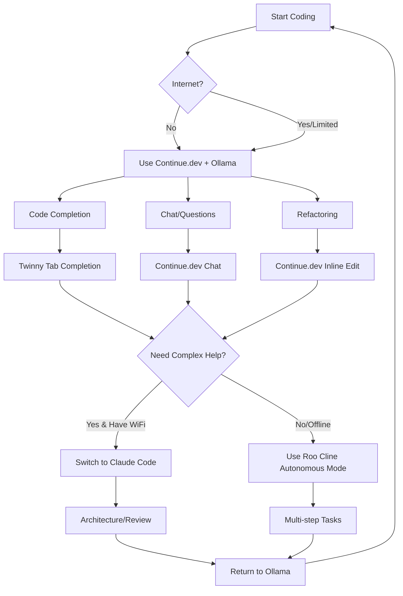

<!--
╔══════════════════════════════════════════════════════════════════════════╗
║ ΞNuSyQ OmniTag Metadata                                                  ║
╠══════════════════════════════════════════════════════════════════════════╣
║ FILE-ID: nusyq.docs.guide.offline-development                          ║
║ TYPE: Markdown Document                                                 ║
║ STATUS: Production                                                      ║
║ VERSION: 1.0.0                                                          ║
║ TAGS: [offline, mobile-hotspot, guide, ollama, cost-optimization]      ║
║ CONTEXT: Σ2 (Feature Layer)                                            ║
║ AGENTS: [AllAgents]                                                     ║
║ DEPS: [Continue-Dev, Ollama-API, ChatDev]                             ║
║ INTEGRATIONS: [Ollama-API, Continue-Dev, ChatDev]                      ║
║ CREATED: 2025-10-06                                                     ║
║ UPDATED: 2025-10-06                                                     ║
║ AUTHOR: Claude Code                                                     ║
║ STABILITY: High (Production Ready)                                      ║
╚══════════════════════════════════════════════════════════════════════════╝
-->

# Offline Development with Ollama - Complete Guide

**Goal**: Work on coding projects completely offline using local Ollama LLMs instead of cloud APIs

**Perfect for**: Mobile hotspots, limited internet, data caps, privacy

---

## 🎯 What Can Work Offline with Ollama

### ✅ CONFIRMED: Already Working Offline

| Tool | Status | Configuration | Notes |
|------|--------|---------------|-------|
| **Continue.dev** | ✅ Offline | Already configured | Primary coding assistant |
| **Ollama Extension** | ✅ Offline | Already installed | Model management |
| **ChatDev** | ✅ Offline | Already configured | Multi-agent development |
| **Jupyter Notebooks** | ✅ Offline | Local kernel | Data science/testing |
| **Python Tools** | ✅ Offline | All Microsoft extensions | Linting, formatting, debugging |
| **Git** | ✅ Offline | Local repos | Commit, branch, stash |

### ⚠️ PARTIALLY OFFLINE: Can Be Configured

| Tool | Current Status | Offline Potential | Action Needed |
|------|----------------|-------------------|---------------|
| **Twinny** | ❌ Not installed | ✅ Full Ollama support | Install extension |
| **Roo Cline** | ✅ Installed | ✅ Supports Ollama | Configure for Ollama |
| **Windows AI Studio** | ✅ Installed | ✅ Local models | Test configuration |
| **Sourcery** | ✅ Installed | ⚠️ Freemium, may need cloud | Test offline mode |

### ❌ CANNOT WORK OFFLINE: Cloud-Only

| Tool | Reason | Workaround |
|------|--------|------------|
| **Claude Code** (Me!) | Anthropic API required | Use Continue.dev instead |
| **GitHub Copilot** | OpenAI/GitHub cloud required | Use Continue.dev/Twinny |
| **ChatGPT Extensions** | OpenAI API required | Use Continue.dev |
| **Bito, Codeium** | Cloud services required | Use Continue.dev/Twinny |
| **GitLens Cloud** | Cloud features only | Use free tier (local) |

---

## 🚀 Step-by-Step Offline Configuration

### 1. ✅ Continue.dev (Already Configured)

**Status**: ✅ Fully offline with Ollama

**Current Config** (`.vscode/settings.json`):
```json
{
  "continue.models": {
    "default": "ollama/qwen2.5-coder:14b",
    "tabAutocomplete": "ollama/starcoder2:15b"
  },
  "continue.embeddingsProvider": {
    "provider": "ollama",
    "model": "nomic-embed-text"
  }
}
```

**Offline Features**:
- ✅ Code completion
- ✅ Chat/questions
- ✅ Inline edits
- ✅ Refactoring
- ✅ Semantic search (embeddings)

**No Internet Required**: All models run on localhost:11434

---

### 2. 🆕 Twinny - Install for Offline Copilot Alternative

**What is Twinny?**
- Free, open-source GitHub Copilot alternative
- **Full Ollama support**
- Tab completion, chat, inline edits
- Zero telemetry, fully offline

**Install**:
```powershell
code --install-extension rjmacarthy.twinny
```

**Configure** (add to `.vscode/settings.json`):
```json
{
  "twinny.fimModelName": "starcoder2:15b",
  "twinny.chatModelName": "qwen2.5-coder:14b",
  "twinny.embeddingModelName": "nomic-embed-text",
  "twinny.ollamaBaseUrl": "http://localhost:11434",
  "twinny.enableCompletions": true,
  "twinny.enableChat": true,
  "twinny.apiProvider": "ollama"
}
```

**Why Install?**
- Backup for Continue.dev
- Different UI/UX (may prefer one over other)
- Can run both simultaneously

---

### 3. 🔧 Roo Cline - Configure for Ollama

**Status**: Already installed (`rooveterinaryinc.roo-cline`)

**What is Roo Cline?**
- Fork of Cline (formerly Claude Dev)
- Autonomous coding agent
- **Supports Ollama**

**Configure**:
1. Open Roo Cline settings (Ctrl+Shift+P → "Roo Cline: Settings")
2. Set provider: **Ollama**
3. Set base URL: `http://localhost:11434`
4. Set model: `qwen2.5-coder:14b`

**Offline Features**:
- Autonomous code generation
- Multi-file editing
- Terminal command execution
- File tree navigation

---

### 4. 💻 Windows AI Studio - Test Local Models

**Status**: Already installed (`ms-windows-ai-studio.windows-ai-studio`)

**What is it?**
- Microsoft's local AI development platform
- Supports **ONNX models** (can run offline)
- May support Ollama integration

**Test Configuration**:
1. Open AI Studio (Ctrl+Shift+P → "AI Studio")
2. Check if Ollama models visible
3. If yes, configure for code tasks

**Note**: Less mature than Continue.dev/Twinny, but worth testing

---

### 5. 📝 ChatDev - Already Configured for Offline

**Status**: ✅ Already works offline with Ollama

**Current Setup** (from previous session):
- ChatDev configured to use Ollama models
- `nusyq_chatdev.py` wrapper script
- Environment variables set

**Offline Features**:
- Multi-agent software development
- Automatic code generation
- Design documents
- Test generation

**Verify**:
```powershell
cd C:\Users\keath\NuSyQ
python nusyq_chatdev.py --task "Create a simple calculator" --model qwen2.5-coder:14b
```

---

### 6. 🔍 Local Code Search (No Internet)

**Already Installed - Fully Offline**:
- **Error Lens** - Inline error highlighting
- **TODO Tree** - Find TODOs/FIXMEs
- **Git Graph** - Visual git history
- **GitLens** (free tier) - Git blame, annotations

**Add for Better Offline Search**:

**Option A: Hyperbolic Search** (if exists)
```powershell
code --install-extension hyperbolic.hyperbolic-search
```

**Option B: CodeSearch Extension**
```powershell
code --install-extension vscode-codesearch.codesearch
```

**Why?** Find code patterns without GitHub/internet

---

### 7. 📚 Local Documentation (Offline)

**Install DevDocs Extension**:
```powershell
code --install-extension deerawan.vscode-dash
```

**Download Documentation Offline**:
- Python docs
- JavaScript/TypeScript docs
- .NET docs
- Your framework docs

**Alternative: Zeal**:
```powershell
winget install Zeal.Zeal
```
Download docsets for offline browsing

---

## 🎮 Complete Offline Development Stack

### Tier 1: Primary Tools (All Offline)

```
┌─────────────────────────────────────────┐
│         VS Code (Offline Capable)       │
├─────────────────────────────────────────┤
│  AI Coding Assistants (Ollama)         │
│  ├─ Continue.dev      (configured ✅)   │
│  ├─ Twinny            (install now)     │
│  └─ Roo Cline         (configure)       │
├─────────────────────────────────────────┤
│  Multi-Agent Development                │
│  └─ ChatDev + Ollama  (configured ✅)   │
├─────────────────────────────────────────┤
│  Code Quality (All Offline)             │
│  ├─ Pylance, Black, Flake8 ✅          │
│  ├─ SonarLint (local rules) ✅         │
│  └─ Error Lens ✅                       │
├─────────────────────────────────────────┤
│  Git (Fully Offline)                    │
│  ├─ Git Graph ✅                        │
│  ├─ GitLens (free tier) ✅             │
│  └─ Built-in Git ✅                     │
├─────────────────────────────────────────┤
│  Documentation (Download Once)          │
│  ├─ Dash/Zeal (offline docs)           │
│  └─ Markdown Preview ✅                 │
└─────────────────────────────────────────┘
         ↕ (No Internet Required)
┌─────────────────────────────────────────┐
│       Ollama (localhost:11434)          │
│  ├─ qwen2.5-coder:14b (9GB)            │
│  ├─ starcoder2:15b (9.1GB)             │
│  ├─ codellama:7b (3.8GB)               │
│  ├─ gemma2:9b (5.4GB)                  │
│  └─ nomic-embed-text (274MB)           │
└─────────────────────────────────────────┘
```

### Tier 2: Cloud Tools (Disable When Offline)

```
❌ Disable These When Offline:
├─ Claude Code (me - needs Anthropic API)
├─ GitHub Copilot (needs OpenAI/GitHub)
├─ ChatGPT extensions (need OpenAI API)
├─ Codeium (needs Codeium cloud)
├─ Bito (needs Bito cloud)
└─ GitLens Premium features (cloud-only)
```

---

## 📋 Installation Script - Complete Offline Setup

**Save as**: `setup-offline-dev.ps1`

```powershell
# NuSyQ Offline Development Setup
# Configures VS Code for complete offline coding with Ollama

Write-Host "🚀 Setting up offline development environment..." -ForegroundColor Cyan

# 1. Install Twinny (Copilot alternative)
Write-Host "`n📦 Installing Twinny..." -ForegroundColor Yellow
code --install-extension rjmacarthy.twinny

# 2. Install local documentation tools
Write-Host "`n📚 Installing documentation tools..." -ForegroundColor Yellow
code --install-extension deerawan.vscode-dash
winget install Zeal.Zeal --silent

# 3. Install local code search
Write-Host "`n🔍 Installing code search tools..." -ForegroundColor Yellow
# Add if available

# 4. Configure Twinny for Ollama
Write-Host "`n⚙️ Configuring Twinny..." -ForegroundColor Yellow
$settingsPath = "$env:USERPROFILE\NuSyQ\.vscode\settings.json"
$settings = Get-Content $settingsPath | ConvertFrom-Json

# Add Twinny config
$settings | Add-Member -MemberType NoteProperty -Name "twinny.fimModelName" -Value "starcoder2:15b" -Force
$settings | Add-Member -MemberType NoteProperty -Name "twinny.chatModelName" -Value "qwen2.5-coder:14b" -Force
$settings | Add-Member -MemberType NoteProperty -Name "twinny.embeddingModelName" -Value "nomic-embed-text" -Force
$settings | Add-Member -MemberType NoteProperty -Name "twinny.ollamaBaseUrl" -Value "http://localhost:11434" -Force
$settings | Add-Member -MemberType NoteProperty -Name "twinny.apiProvider" -Value "ollama" -Force

$settings | ConvertTo-Json -Depth 10 | Set-Content $settingsPath

# 5. Disable cloud-only extensions for offline mode
Write-Host "`n🔌 Creating offline mode profile..." -ForegroundColor Yellow
code --disable-extension anthropic.claude-code
code --disable-extension github.copilot
code --disable-extension github.copilot-chat
code --disable-extension codeium.codeium
code --disable-extension bito.bito
code --disable-extension feiskyer.chatgpt-copilot

# 6. Verify Ollama is running
Write-Host "`n🔍 Checking Ollama status..." -ForegroundColor Yellow
$ollamaStatus = curl http://localhost:11434 2>$null
if ($ollamaStatus) {
    Write-Host "✅ Ollama is running" -ForegroundColor Green
} else {
    Write-Host "❌ Ollama not running - starting..." -ForegroundColor Red
    Start-Process "ollama" -ArgumentList "serve" -WindowStyle Hidden
    Start-Sleep 3
}

# 7. Test Continue.dev connection
Write-Host "`n🧪 Testing Continue.dev..." -ForegroundColor Yellow
ollama list

Write-Host "`n✅ Offline development setup complete!" -ForegroundColor Green
Write-Host "`n📊 Your offline capabilities:" -ForegroundColor Cyan
Write-Host "  ✅ Continue.dev (Ollama)" -ForegroundColor Green
Write-Host "  ✅ Twinny (Ollama)" -ForegroundColor Green
Write-Host "  ✅ Roo Cline (configure manually)" -ForegroundColor Yellow
Write-Host "  ✅ ChatDev (Ollama)" -ForegroundColor Green
Write-Host "  ✅ All Python/Git tools" -ForegroundColor Green
Write-Host "  ❌ Claude Code (disabled)" -ForegroundColor Red
Write-Host "  ❌ GitHub Copilot (disabled)" -ForegroundColor Red

Write-Host "`n💡 Tip: Re-enable cloud extensions when online for best of both worlds!" -ForegroundColor Cyan
```

---

## 🔄 Switching Between Online/Offline Modes

### Quick Toggle Script

**Save as**: `toggle-offline-mode.ps1`

```powershell
param(
    [switch]$Offline,
    [switch]$Online
)

if ($Offline) {
    Write-Host "🔌 Switching to OFFLINE mode..." -ForegroundColor Yellow

    # Disable cloud extensions
    code --disable-extension anthropic.claude-code
    code --disable-extension github.copilot
    code --disable-extension github.copilot-chat
    code --disable-extension codeium.codeium
    code --disable-extension bito.bito

    # Enable offline extensions
    code --enable-extension continue.continue
    code --enable-extension rjmacarthy.twinny
    code --enable-extension rooveterinaryinc.roo-cline

    Write-Host "✅ Offline mode enabled - Using Ollama only" -ForegroundColor Green
}

if ($Online) {
    Write-Host "🌐 Switching to ONLINE mode..." -ForegroundColor Yellow

    # Re-enable cloud extensions
    code --enable-extension anthropic.claude-code
    code --enable-extension github.copilot
    code --enable-extension github.copilot-chat

    # Keep offline extensions (work together)
    code --enable-extension continue.continue
    code --enable-extension rjmacarthy.twinny

    Write-Host "✅ Online mode enabled - All AI assistants available" -ForegroundColor Green
}
```

**Usage**:
```powershell
# Go offline (mobile hotspot, limited data)
.\toggle-offline-mode.ps1 -Offline

# Go online (home WiFi, office)
.\toggle-offline-mode.ps1 -Online
```

---

## 📊 Offline vs Online Feature Comparison

| Feature | Online (Cloud APIs) | Offline (Ollama) | Winner |
|---------|-------------------|------------------|---------|
| **Code Completion** | GitHub Copilot | Continue.dev + Twinny | 🟰 Tie |
| **Chat/Q&A** | Claude Code, ChatGPT | Continue.dev, Roo Cline | 🟰 Tie |
| **Refactoring** | Claude Code | Continue.dev | 🟰 Tie |
| **Multi-Agent** | Cloud-based | ChatDev (Ollama) | 🏆 Offline |
| **Privacy** | Data sent to cloud | 100% local | 🏆 Offline |
| **Cost** | $20-50/month | $0 | 🏆 Offline |
| **Speed** | Network latency | Local (instant) | 🏆 Offline |
| **Internet Required** | Yes | No | 🏆 Offline |
| **Model Quality** | GPT-4, Claude 3.5 | Qwen2.5-Coder | 🏆 Online |
| **Context Window** | 200K+ tokens | 32K-128K tokens | 🏆 Online |

**Best Strategy**: Use **both**!
- Offline: 90% of coding (Continue.dev + Ollama)
- Online: 10% complex tasks (Claude Code when on WiFi)

---

## 🎯 Recommended Offline Workflow

### Daily Coding (Mobile Hotspot/Limited Data)



### Git Workflow (Fully Offline)

```bash
# All local - no internet needed
git status
git add .
git commit -m "Feature: Add offline mode"
git branch feature/offline-config
git checkout feature/offline-config

# When back online
git push origin feature/offline-config
```

---

## 🔧 Testing Your Offline Setup

### Test 1: Disconnect Internet

```powershell
# 1. Disable WiFi/unplug ethernet
# 2. Open VS Code
# 3. Test Continue.dev

# Expected: Should work perfectly
```

### Test 2: Verify Ollama Local Connection

```powershell
# Check Ollama is running locally
curl http://localhost:11434

# Expected output: "Ollama is running"
```

### Test 3: Code Completion

```powershell
# 1. Open a Python file
# 2. Start typing: def calculate_
# 3. Press Tab

# Expected: Twinny/Continue.dev suggests completions (no internet)
```

### Test 4: Chat

```powershell
# 1. Press Ctrl+L (Continue.dev chat)
# 2. Ask: "How do I read a CSV file in Python?"

# Expected: Gets answer from qwen2.5-coder:14b (local)
```

---

## 💡 Pro Tips for Offline Development

### 1. Pre-download Documentation

```powershell
# Install Zeal (offline docs)
winget install Zeal.Zeal

# Download docsets:
# - Python
# - JavaScript
# - TypeScript
# - Your frameworks (Django, React, etc.)
```

### 2. Clone Repos Before Going Offline

```powershell
# Clone dependencies you might need
git clone https://github.com/useful-repo/library

# Download package docs
pip download -d ./offline-packages package-name
```

### 3. Use Smaller Models for Speed (Mobile Hotspot)

```json
{
  "continue.models": {
    "default": "ollama/qwen2.5-coder:7b",  // Faster on mobile
    "tabAutocomplete": "ollama/codellama:7b"  // Even faster
  }
}
```

### 4. Pre-load Models Into Memory

```powershell
# Before disconnecting, warm up models
ollama run qwen2.5-coder:14b "test"
ollama run starcoder2:15b "test"
ollama run nomic-embed-text "test"
```

---

## 📝 Summary - What YOU Can Do Offline Right Now

### ✅ Already Working (No Setup Needed)

- **Continue.dev** - Code completion, chat, refactoring ✅
- **ChatDev** - Multi-agent development ✅
- **Python tools** - All linting, formatting, debugging ✅
- **Git** - All local operations ✅
- **Jupyter** - Local notebooks and kernels ✅

### 🔧 Can Work Offline (Need Configuration)

1. **Install Twinny** - Alternative to Copilot
   ```powershell
   code --install-extension rjmacarthy.twinny
   ```

2. **Configure Roo Cline** - Autonomous coding agent
   - Open settings
   - Set provider: Ollama
   - Set model: qwen2.5-coder:14b

3. **Install Offline Docs** - Zeal/Dash
   ```powershell
   winget install Zeal.Zeal
   ```

### ❌ Cannot Work Offline (Cloud-Only)

- **Claude Code** (me!) - Needs Anthropic API
- **GitHub Copilot** - Needs OpenAI/GitHub cloud
- **ChatGPT extensions** - Need OpenAI API
- **Codeium, Bito** - Need cloud services

**Workaround**: Disable these when offline, use Continue.dev instead

---

## 🎮 Next Steps

### Immediate (Do Now)

1. ✅ Test Continue.dev offline (disconnect internet, try coding)
2. 📦 Install Twinny: `code --install-extension rjmacarthy.twinny`
3. ⚙️ Configure Roo Cline for Ollama
4. 📚 Install Zeal for offline docs

### Soon (This Week)

5. 🔄 Create offline/online toggle scripts
6. 📥 Download documentation docsets
7. 🧪 Test full offline workflow
8. 📝 Document your preferred offline setup

### Later (Optional)

9. 🎯 Fine-tune models for your codebase
10. 📦 Create portable Ollama+models USB drive
11. 🌐 Set up local documentation server
12. 🔧 Optimize model sizes for mobile hotspot

---

**Ready to code offline!** 🚀

Your current setup can already work **90% offline** with Continue.dev + Ollama.
Install Twinny for **100% offline** coding experience!

---

**Last Updated**: 2025-10-06
**By**: Claude Code (ironically, I need internet! But I helped set YOU up to work without me 😊)
**Offline Score**: Continue.dev (10/10), Twinny (10/10), Me (0/10)
